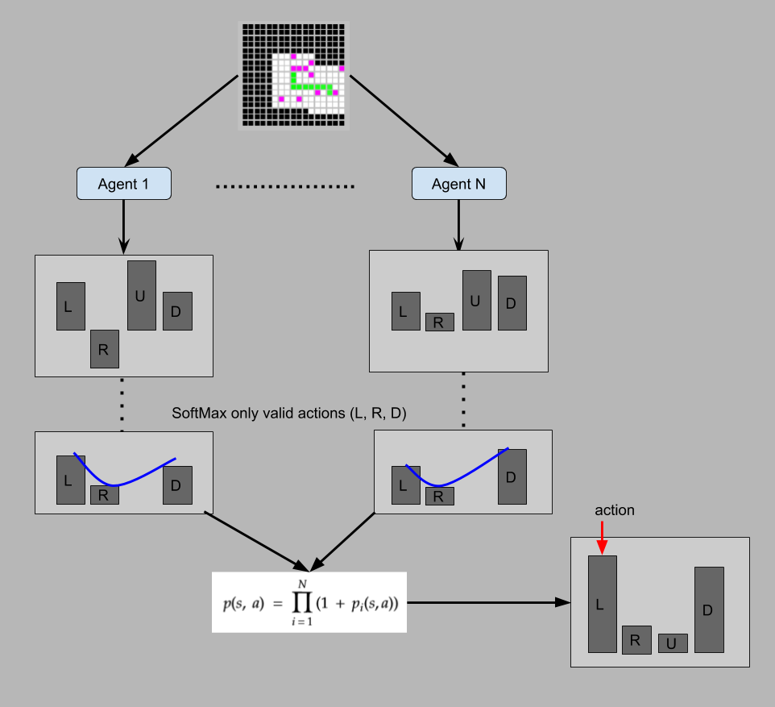
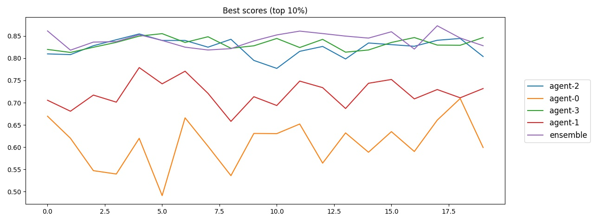
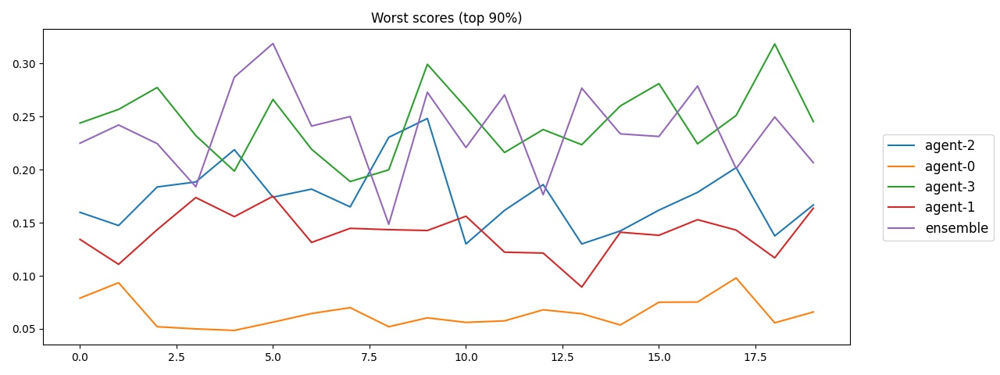

# Deep Maze

[English](README_en.md)

[Video v.0](https://www.youtube.com/watch?v=rSkxOtRhY24)

[Video v.1 (current version)](https://youtu.be/-w3PGBhAnzM)

Этот проект является симуляцией изучения простого grid world-a ботом с ограниченным полем зрения. Очки начисляются исключительно за открытие новых участков мира, что требует, как минимум, планирования и навигации.

Типовые настройки мира:

```
Размер - 64x64
Вероятность генерации препятствия - 80%
Открываемая область пространства вокруг агента - 7x7
Видимая область - 17x17
```

В данный момент, используется простой Q-learning, без какой-либо памяти, поэтому в состояние мира был добавлен срез с данными о прошлых передвижениях агента. Таким образом, агент получает данные о проходимости окружающих его клеток и о передвижениях (проходил ли по ячейке и как давно). Текущая версия окружения является чересчур упрощённой и может быть легко решена алгоритмически, но полученный опыт, приёмы и наблюдения могут быть применены к более реальным задачам. Например, карта может быть расширена до тысяч ячеек, с искажениями и другими осложняющими факторами.

Агенты очень часто застревали в сложных участках, поэтому было добавлено детектирование данного поведения, остановка агента и запуск того же агента в режиме исследования. Полученные таким способом данные помещаются в отдельную память, чтобы потом обучить агента как действовать в подобных ситуациях. Эмпирически эффект заметен, но нельзя однозначно утверждать пользу подобного подхода.

Изначально использовалась CNN (что логичнее для карт), но простая Dense-сетка давала сравнимые результат. Возможно, конечно, что остальные доработки могли привести к более заметному улучшению предсказаний CNN. Кроме того, были испробованы различные варианты наград, начальных условий, предобработки и др.

Длительная тренировка одного агента не давала ощутимого прогресса, поэтому, в итоге, были натренированы 4 версии той же сети и затем их решения объединялись вместе (см. [DQNEnsembleAgent.py](Agent/DQNEnsembleAgent.py)). Ансамбль из агентов позволяет получать более стабильные результаты в сложных ситуациях. Например, если агент попадает в сложный участок пространства, то существенно выше шанс что он сможет попытаться найти выход, чем когда агент основывается на предсказании лишь одной сети.

Общий принцип работы ансамбля:



Ниже показано сравнение верхней границы (кол-во открытой области в 10 симуляциях из 100, по 20 прогонов):



Как видно, ансамбль ведёт себя стабильнее, но не намного лучше отдельных его частей.

А это нижняя граница (кол-во открытой области в 90 симуляциях из 100, по 20 прогонов), при худших начальных условиях:



Опять же, прямо ощутимого улучшения нет, но ансамбль немного стабильнее открывает 20-25% карты.

Следующим шагом будет дистилляция ансамбля в единую сеть, а так же использование полноценной сети для комбинации предсказаний подсетей. Есть большая вероятность того, что это позволит уловить более глубокие корреляции т. к. обучаемая сеть будет уже иметь представление о соотношение Q-values (сами значения индивидуальны для каждой сети).

# Области применения

Подобного рода задачи встречаются повсеместно в робототехнике, например.