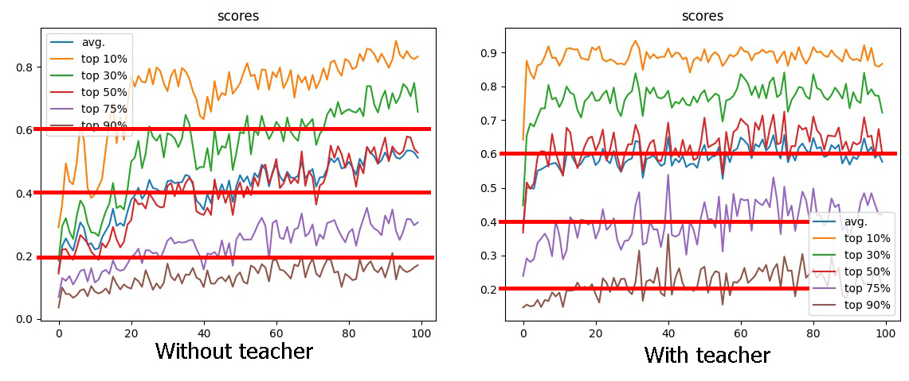
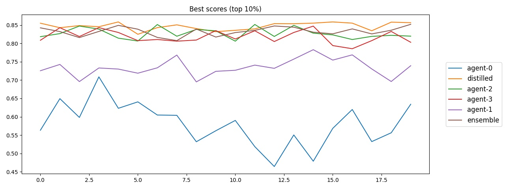
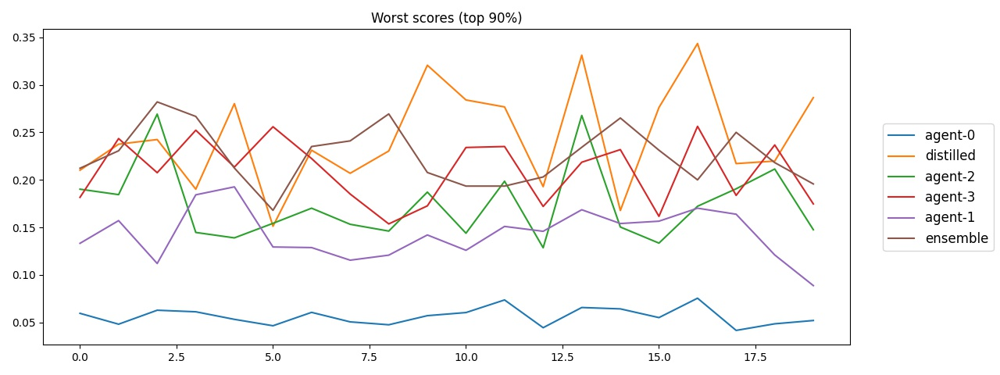

# Deep Maze

[Video v.0](https://www.youtube.com/watch?v=rSkxOtRhY24)

[Video v.1 (current version)](https://youtu.be/-w3PGBhAnzM)

This project is a simulation of a simple grid world exploration by a bot with limited field of view. Points are only awarded for opening new areas of the world, which requires at least planning and navigation.

Typical world settings:scss

```
Size - 64x64
Obstacle generation probability - 80%
Open area around the agent - 7x7
Visible area - 17x17
```

At the moment, a simple Q-learning without any memory is used, so a slice with data on the agent's previous movements was added to the state of the world. Thus, the agent receives data on the passability of the cells around it and on the movements (whether it passed through the cell and how long ago). The current version of the environment is too simplified and can be easily solved algorithmically, but the experience, techniques, and observations gained can be applied to more real-world problems. For example, the map can be expanded to thousands of cells, with distortions and other complicating factors.

Agents often got stuck in difficult areas, so detection of this behavior was added, the agent was stopped and the same agent was launched in exploration mode. The data obtained in this way is placed in separate memory to later train the agent on how to act in similar situations. Empirically, the effect is noticeable, but it cannot be unequivocally stated that this approach is beneficial.

Initially, a CNN was used (which is more logical for grids), but a simple Dense network gave comparable results. Of course, it is possible that other improvements could have led to more noticeable improvements in CNN predictions. In addition, various options for rewards, initial conditions, preprocessing, etc. were tried.

Long training of one agent did not show significant progress, so in the end, 4 versions of the same network were trained and then their solutions were combined together (see [DQNEnsembleAgent.py](Agent/DQNEnsembleAgent.py)). An ensemble of agents allows for more stable results in difficult situations. For example, if an agent gets into a difficult area of space, there is a much higher chance that it will be able to find a way out, than when the agent relies on the prediction of only one network.

The general principle of ensemble:


Below is a comparison of the upper bound (the amount of open space in 10 simulations out of 100, by 20 trials each):


As can be seen, the ensemble behaves more stable, but not significantly better than its individual parts.

And this is the lower bound (the amount of open space in 90 simulations out of 100, by 20 trials each), under the worst initial conditions:


Again, there is no noticeable improvement, but the ensemble opens 20-25% of the map more stably.

# Distillation of the ensemble

The new network was trained with an additional loss that determines the similarity of the Q-values distribution of the trained network with the ensemble prediction.



The supervised neural network almost immediately achieves higher results than the unsupervised one. Moreover, in full-scale tests, it shows itself slightly better than the ensemble:





Some observations:

- The new network is able to show good results for some time (10-30 epochs), if it only "copies" the distribution and does not control the values themselves. This is quite expected, but still interesting.
- The network only copies the distribution, so it is not able to improve the results. It is possible that longer training is needed for the network to fully adapt the Q-values to the ensemble's dictated distribution, and then it could continue training. Is this feasible? Wouldn't it be better to train the network from scratch?
- The ensemble averages the behavior of agents, highlighting common behavior. The new network copies the averaged behavior, also smoothing out the nuances of behavior and strategy. Thus, the new network loses the features that allowed agents to demonstrate better results in special situations. How then to effectively combine the "knowledge" of agents? Useful resources on this topic:
  - [Distill and transfer learning for robust multitask RL (YouTube)](https://www.youtube.com/watch?v=scf7Przmh7c)
  - [Teacher-Student Framework: A Reinforcement Learning Approach](https://www.researchgate.net/publication/280255927_Teacher-Student_Framework_A_Reinforcement_Learning_Approach)
  - [Progressive Reinforcement Learning with Distillation for Multi-Skilled Motion Control](https://arxiv.org/abs/1802.04765)
